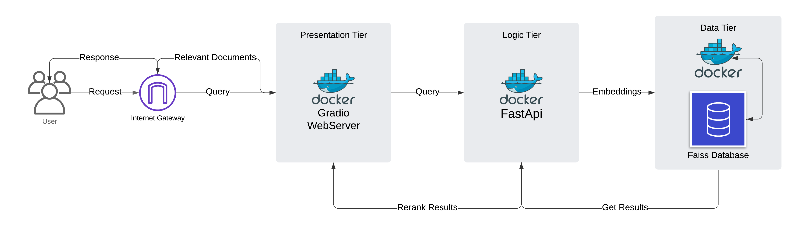

# **CrisisSum**: A Crisis Event Data Retrieval Platform  

## **Overview**  



**CrisisSum** is a containerized platform designed for fast and efficient retrieval, ranking, and summarization of crisis-related events. It combines BM25-based retrieval, FAISS indexing, and embedding-based re-ranking to provide highly relevant results along with detailed evaluation metrics.  

This system leverages:  
- **FastAPI** for building efficient API layers  
- **FAISS** for fast vector similarity searches  
- **Docker Compose** for modular deployment and orchestration  

---  

## **Key Features**  

- **Multi-Stage Retrieval**:  
  - BM25 for initial ranking  
  - FAISS-based embedding search  
  - Re-ranking with **Sentence-Transformers**  
  
- **Evaluation Metrics**:  
  - ROUGE Scores  
  - Cosine Similarity  
  - Jaccard Similarity  
  
- **Containerized Architecture**:  
  - **Backend**: FAISS search server  
  - **App Layer**: FastAPI-based processing and re-ranking  
  - **Frontend**: Interactive UI for querying and viewing results  
  
- **Comprehensive Test Suite**:  
  - Test coverage with `pytest` for all core functionalities  
  - Centralized test coverage in `test_main.py`  

---  

## **Project Structure**  

```plaintext
CrisisSum/
│
├── CODE_OF_CONDUCT.md           # Code of Conduct  
├── CONTRIBUTING.md              # Contribution Guidelines  
├── LICENSE                      # MIT License  
├── docker-compose.yml           # Docker Compose for deployment  
├── data/                        # Input Dataset (combined_data.csv)  
├── initial_cleaned_data/        # Cleaned and partitioned datasets  
│
├── src/                         # Source Code  
│   └── crisissum/  
│       ├── backend/             # FAISS backend service  
│       ├── app_layer/           # FastAPI application layer  
│       ├── frontend/            # Frontend service  
│       ├── preprocessing/       # Data cleaning and FAISS index generation scripts  
│       ├── retrieval/           # Retrieval utilities  
│       └── __init__.py  
│
├── tests/                       # Unit and Integration Tests  
│   └── test_main.py             # Comprehensive test suite  
│
├── pyproject.toml               # Project Dependencies  
├── requirements.txt             # Python Requirements  
└── README.md                    # Project Overview  
```  

---  

## **Quick Start**  

### **Prerequisites**  

- Install [Docker](https://docs.docker.com/get-docker/) and [Docker Compose](https://docs.docker.com/compose/).  
- Optional: Install Python 3.10+ for local testing and development.  
- Git LFS
---  


## **Using Git LFS (Large File Storage)**  

This project includes large files like **datasets (CSV/Parquet)** and **FAISS indices**, which are required to run the platform. To manage these files efficiently and ensure a lightweight repository, we use **Git LFS (Large File Storage)**.

### **Why Git LFS?**  
- Handles large files such as `.csv`, `.parquet`, and `.index` files.  
- Ensures that these critical files are **stored and retrieved efficiently**.  
- Keeps repository clones lightweight while still enabling Docker containers to access the necessary files.

---

### **Setup Git LFS**  

1. **Install Git LFS**:  
   Follow the instructions for your operating system:  
   [Git LFS Installation Guide](https://git-lfs.github.com/).  

1. **Clone the Repository with LFS Files**:  

   If you're cloning the project for the first time, make sure to fetch the LFS files:  

   ```bash
   git clone https://github.com/DSAN6700-24Fall/final-project-five-guys.git
   cd final-project-five-guys
   git lfs pull
   ```

---

### **Files Tracked by Git LFS**  

- **Dataset Files**:  
   - `data/combined_data.csv`  
   - `initial_cleaned_data/cleaned_crisisfacts_data.csv`  
   - `initial_cleaned_data/cleaned_crisisfacts_data.parquet`  

- **FAISS Index Files**:  
   - `src/crisissum/backend/faiss_indices/*.index`  

---

### **Ensure Docker Access to LFS Files**  

To run the Docker containers successfully, ensure that Git LFS files are fetched locally before starting the services:  

```bash
git lfs pull
docker-compose up --build
```

---

### **Verify LFS Files**  

You can verify that large files are tracked by Git LFS:  

```bash
git lfs ls-files
```

This command will display all files currently being managed by Git LFS.  

---

### **Run the Project**  

1. **Clone the Repository**:  
   ```bash
   git clone https://github.com/DSAN6700-24Fall/final-project-five-guys.git
   cd final-project-five-guys
   ```  

2. **Start All Services**:  
   ```bash
   docker-compose up --build
   ```  

3. **Access the Services**:  
   - **Backend**: [http://localhost:8001](http://localhost:8001) *(Debug Only)*  
   - **App Layer**: [http://localhost:8000](http://localhost:8000) *(Debug Only)*  
   - **Frontend**: [http://localhost:7860](http://localhost:7860)  

   🚨 **ONLY ACCESS THE FRONTEND** — The **Backend** and **App Layer** are internal services and should not be accessed directly unless debugging.  

---  

## **Testing**  

Run all tests locally to ensure full code coverage:  

1. **Install Dependencies**:  
   ```bash
   pip install -r requirements.txt
   ```  

2. **Run Tests**:  
   ```bash
   pytest tests/
   ```  

### **Test Coverage**  

The central `test_main.py` includes coverage for:  
- Text preprocessing (cleaning inputs)  
- Metrics computation (ROUGE, Cosine Similarity, Jaccard Similarity)  
- Health check endpoint  
- Query endpoint with mock FAISS responses  

---  

## **Data Preprocessing**  

We have cleaned and preprocessed data, for FAISS, if you dont have a GPU, Builing an index and preprocessing data takes approximately 50+ hours. For this reason, do not rerun the preprocessing script or building a faiss index. All of this is already included. but if you really want to, then you can, but it might not work as this is all GPU specific code.

---

### **1. Combine CSV Files**

#### **Script**: `src/crisissum/preprocessing/combine_csv.py`

This script combines multiple CSV files from a directory into a single output CSV file.

**Usage**:
```bash
python src/crisissum/preprocessing/combine_csv.py --input_dir /path/to/input_dir --output_file /path/to/output.csv
```

**Arguments**:
- `--input_dir`: Directory containing the input CSV files.
- `--output_file`: Path to save the combined CSV file.

**Example**:
```bash
python src/crisissum/preprocessing/combine_csv.py --input_dir data/cleaned_crisisfacts/ --output_file data/combined_data.csv
```

---

### **2. Preprocess Text Data**

#### **Script**: `src/crisissum/preprocessing/preprocessing.py`

This script preprocesses text data by tokenizing, removing stopwords, and extracting entities.

**Usage**:
```bash
python src/crisissum/preprocessing/preprocessing.py --input_file /path/to/input.parquet --output_file /path/to/output.csv --text_column text
```

**Arguments**:
- `--input_file`: Path to the input Parquet file.
- `--output_file`: Path to save the preprocessed CSV file.
- `--text_column`: Column name containing the text to preprocess.

**Example**:
```bash
python src/crisissum/preprocessing/preprocessing.py --input_file data/cleaned_crisisfacts_data.parquet --output_file data/preprocessed_crisisfacts_data.csv --text_column text
```

---

### **3. Populate FAISS Index**

#### **Script**: `src/crisissum/preprocessing/populate_faiss_index.py`

This script creates and populates FAISS indices (e.g., float32) for fast similarity searches.

**Usage**:
```bash
python src/crisissum/preprocessing/populate_faiss_index.py --data_file /path/to/data.csv --index_dir /path/to/index_dir
```

**Arguments**:
- `--data_file`: Path to the input data file (CSV).
- `--index_dir`: Directory to store the FAISS indices.

**Example**:
```bash
python src/crisissum/preprocessing/populate_faiss_index.py --data_file data/combined_data.csv --index_dir data/faiss_indices/
```

---

### **4. Dimensionality Reduction and Clustering**

#### **Script**: `src/crisissum/dimensionality_reduction.py`

This script performs dimensionality reduction (PCA and t-SNE) and clusters data using KMeans.

**Usage**:
```bash
python src/crisissum/dimensionality_reduction.py --input_file /path/to/preprocessed.csv --text_column preprocessed_text
```

**Arguments**:
- `--input_file`: Path to the preprocessed CSV file.
- `--text_column`: Column name containing the preprocessed text.

**Example**:
```bash
python src/crisissum/dimensionality_reduction.py --input_file data/preprocessed_crisisfacts_data.csv --text_column preprocessed_text
```

---

### **5. Clustering Analysis**

#### **Script**: `src/crisissum/clustering.py`

This script analyzes clusters using KMeans and DBSCAN.

**Usage**:
```bash
python src/crisissum/clustering.py --input_file /path/to/preprocessed.csv --text_column preprocessed_text --n_clusters 5
```

**Arguments**:
- `--input_file`: Path to the preprocessed CSV file.
- `--text_column`: Column name containing the preprocessed text.
- `--n_clusters`: Number of clusters for KMeans (default: 5).

**Example**:
```bash
python src/crisissum/clustering.py --input_file data/preprocessed_crisisfacts_data.csv --text_column preprocessed_text --n_clusters 5
``` 

---

### Notes

- Make sure all dependencies are installed as specified in the `requirements.txt` or `pyproject.toml` files.
- Replace `/path/to/...` with the actual paths in your environment.

---  

## **Contributing**  

We welcome contributions! To get started:  
1. Read the [CONTRIBUTING.md](CONTRIBUTING.md).  
2. Fork the repository.  
3. Create a feature branch (`feature/your-feature`).  
4. Submit a pull request!  

Please follow the [CODE_OF_CONDUCT.md](CODE_OF_CONDUCT.md) when contributing.  

---  

## **License**  

This project is licensed under the **MIT License**. See [LICENSE](LICENSE) for details.  

---  

## **Authors**  

This project was developed as part of the DSAN6700 course.  
**Authors**:  
- Dheeraj Oruganty  
- Will Corbin  
- Pranav Patil  

---  

## **Acknowledgments**  

This project leverages the following tools and libraries:  
- **FAISS**: Efficient similarity search  
- **FastAPI**: Modern API development  
- **Sentence-Transformers**: For embeddings  
- **BM25**: Keyword-based retrieval  
- **Docker**: Containerization and deployment  

Feel free to create issues for bugs, suggestions, or improvements! 🚀  

---  