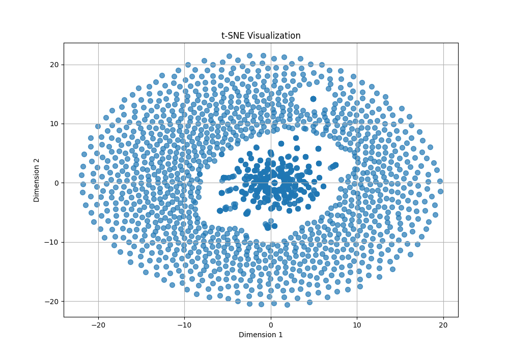

# **Discussion**

### **Introduction**

For this project, we decided to work on the CRISISFacts track, with the goal of creating fast retrieval technologies for emerging crisis events. CRISISFacts provides a diverse set of data streams, including Twitter/X, Reddit, Facebook, and online news sources. The goal of our project was to enable real-time retrieval of the information disseminated from these sources to aid public response to crisis events. This is particularly valuable for stakeholders like first responders, emergency managers, and policy-makers, who need quick, reliable, and organized information to make informed decisions during emergencies.

Our project aimed to address the challenges of extracting, organizing, and ranking relevant information from these streams to provide concise, actionable summaries of events. These challenges include handling noisy and unstructured text, processing large-scale datasets, and ensuring relevance and accuracy in summaries. To tackle these, we designed and implemented a structured approach:

1. **Data Ingestion and Preprocessing**: Using Python and Spark, we built robust pipelines to clean, normalize, and preprocess the textual data to ensure consistent formatting across various data streams.
2. **Feature Engineering**: Leveraging techniques like dimensionality reduction and clustering, we identified key information clusters to structure the data better.
3. **Summarization Framework**: We implemented a hybrid model combining extractive summarization for relevant snippet retrieval and neural-based methods for context-aware ranking and abstractive summarization.
4. **Evaluation**: Throughout the process, we evaluated the system's performance using retrieval time, relevance metrics, and cost-effectiveness.
5. **User Interface Development and Deployment**: We developed a user-friendly interface to enable intuitive search and retrieval functionality and deployed the solution using containerized services for scalability.

### **System Architecture**

The following diagram illustrates the end-to-end architecture of the CRISISFacts summarization system. This modular design ensures scalability, efficiency, and real-time query processing.

1. **Presentation Tier**: Gradio-based WebServer for user interaction.  
2. **Logic Tier**: A FastAPI backend handles query processing and orchestrates retrieval logic.  
3. **Data Tier**: FAISS, a highly optimized vector database, stores the embeddings and enables efficient nearest-neighbor search.

The modular architecture allows seamless integration between components. Queries are passed from the frontend to the application layer and then to the backend for embedding search and re-ranking.

  

---

### **Data Subsetting, Preprocessing, and Exploratory Data Analysis (EDA)**

#### **Data Subsetting and Preprocessing**
A critical component of the project involved preprocessing large volumes of text data from various sources. This was achieved through a systematic pipeline developed in Python. The preprocessing workflow included the following steps:

1. **Loading and Normalizing Data**: We used Pandas to load raw Parquet files and ensure compatibility across different formats. The `load_parquet` function enabled seamless data ingestion while handling potential errors in file loading.

2. **Text Tokenization and Stopword Removal**: The project employed `nltk` for tokenization and stopword removal. These processes transformed text into tokens and filtered out irrelevant words to reduce noise and improve model input quality.

3. **Entity Recognition and Normalization**: Using SpaCy, we identified named entities such as locations, people, and organizations in the text. This step added semantic depth to the processed data, enabling context-aware clustering and summarization.

4. **Output Preparation**: Finally, the processed data was saved to CSV files for downstream tasks. This ensured that the cleaned data was reusable and accessible to other modules in the pipeline.

#### **Exploratory Data Analysis (EDA)**

The exploratory data analysis (EDA) phase of our project aimed to uncover hidden patterns and evaluate the structure of the textual data. This step was critical in identifying clusters, outliers, and meaningful information from a vast dataset of crisis-related information.

**1. Text Vectorization**
To convert unstructured text into a format suitable for machine learning, we implemented the `vectorize_text` function using the TF-IDF (Term Frequency-Inverse Document Frequency) technique. This process:
- Transformed textual data into numerical vectors, representing the importance of words in the corpus.
- Limited the vocabulary size to 5000 terms to balance computational efficiency and expressiveness.
The TF-IDF matrix generated served as the foundation for clustering and dimensionality reduction tasks.

**2. Clustering with KMeans**
KMeans clustering was applied to group similar documents based on their TF-IDF representations. Using the `apply_kmeans` function, the algorithm divided the data into user-specified clusters (`n_clusters`). This process:
- Assigned cluster labels to each document based on proximity in the vector space.
- Created groupings that reflected thematic similarities in the text.

The silhouette score, a metric for evaluating the cohesion and separation of clusters, was computed to assess the quality of clustering. Higher scores indicated well-defined clusters.

**3. Clustering with DBSCAN**
We further explored the structure of the data using DBSCAN (Density-Based Spatial Clustering of Applications with Noise). The `apply_dbscan` function allowed for:
- Detection of clusters based on density, without requiring predefined cluster counts.
- Identification of noise points (outliers) that did not belong to any cluster.

This method was particularly effective in highlighting smaller, dense clusters within the dataset.

**4. Dimensionality Reduction and Visualization**
To visualize high-dimensional text data, we used PCA (Principal Component Analysis) to project the TF-IDF vectors into a 2D space. The `analyze_clusters` function incorporated PCA for dimensionality reduction and plotted the clusters using Matplotlib. These visualizations:
- Provided an intuitive understanding of cluster separations.
- Highlighted the thematic cohesion of documents within clusters.

Both KMeans and DBSCAN results were visualized, offering complementary perspectives on the underlying data distribution.

### **KMeans Clustering Visualization**

The figure below visualizes the clustering results produced by the **KMeans algorithm**. Using **TF-IDF vectorization** to extract meaningful features from the textual data, we applied **Principal Component Analysis (PCA)** to reduce the data's dimensionality to two components. This allowed for better visualization of the high-dimensional clusters.

From the visualization:  
- Each color represents a different cluster as identified by KMeans.  
- The data appears well separated into regions, but there is visible overlap between certain clusters, indicating the similarity of text in those areas.  
- Cluster 4 (yellow) occupies a distinct region, suggesting it contains a group of highly related documents.

  

### **PCA Visualization**

This image represents the **PCA results** for dimensionality reduction, which was crucial for understanding the high-dimensional TF-IDF features.  
- PCA projects the data onto two dimensions (PCA Dimension 1 and PCA Dimension 2), capturing the maximum variance in the data.  
- The color-coded clusters correspond to the KMeans clustering results.  
- The distinct spatial regions suggest that PCA is effective in retaining the structure of the clusters while reducing the dimensionality.  

Key Observations:  
- PCA successfully reduces the data to a two-dimensional space while preserving the clustering structure.  
- Cluster 4 (yellow) remains clearly separated, reinforcing its distinction from the other clusters.

  

### **t-SNE Visualization**

The t-SNE visualization highlights the non-linear relationships in the data after dimensionality reduction. Unlike PCA, **t-SNE** focuses on preserving local structure within the data, which helps in identifying finer patterns among text samples.

Observations:  
- The t-SNE plot forms a more circular structure, with a concentration of data points in the center and spread-out regions towards the boundary.  
- This suggests that many text samples are highly similar and overlap significantly.  
- Outliers can be seen towards the periphery of the visualization, representing unique or dissimilar text data.  

While t-SNE is useful for visualizing high-dimensional data, it does not maintain the same global relationships as PCA.

  

### **DBSCAN Clustering Visualization**

This visualization shows the clustering results obtained using **DBSCAN**, a density-based clustering method. Unlike KMeans, DBSCAN identifies clusters based on density and marks noise points that do not belong to any cluster.

Key Observations:  
- A significant number of points (colored as 0) are identified as noise.  
- The remaining clusters are less distinct compared to KMeans, which indicates that DBSCAN struggles to form well-separated clusters due to the high dimensionality and sparse nature of TF-IDF data.  
- The presence of noise points is useful for identifying outliers or unstructured data in the collection.

  

These visualizations collectively demonstrate the effectiveness of different clustering techniques and dimensionality reduction approaches in identifying patterns within high-dimensional text data.

### **Methodology**

#### **Frontend**

We implemented the frontend using **Gradio**, a lightweight and versatile library for building machine learning interfaces. Gradio enables the creation of highly interactive and user-friendly interfaces with minimal effort, which aligns perfectly with our goal of creating a deployable, real-time system for querying and summarizing crisis-related data.

**Core Functionality**
1. **Integration with the Application Layer**  
   The frontend serves as the user interface, forwarding user queries to the application layer and displaying ranked results and retrieval metrics. The critical function here is `search_query`, which:

   - **Takes Input from the User**: Users provide a search query and specify the number of top results (`top_k`) they want to retrieve.

   - **Forwards the Request**: The function sends a GET request to the application layer using the **`requests`** library. This choice is due to its simplicity and robustness for handling HTTP requests, enabling seamless communication with the backend.

   - **Handles Responses**: Responses from the application layer are parsed into results (retrieved documents) and metrics (e.g., retrieval time and ranking performance). These are formatted into a JSON object to ensure consistency and readability.

   By encapsulating this logic, `search_query` acts as a bridge between the user and the application layer, abstracting complex backend operations.

2. **Error Handling**  
   Robust error handling ensures that:
   - Any HTTP-related errors (e.g., timeouts or connection issues) are logged and displayed to the user.
   - Unexpected failures in processing queries or responses are caught and logged to maintain system stability. Logging is implemented via Python’s built-in **`logging`** module to track interactions and identify potential issues.

**Why Gradio?**
Gradio was chosen for its seamless integration with Python, making it ideal for rapid prototyping and deployment of machine learning applications. Its declarative interface design allows us to focus on functionality rather than building extensive UI logic. Key features we leveraged include:

- **Textbox Input**: Users enter queries in a simple and intuitive text field.

- **Slider for Top-K Results**: This adjustable slider empowers users to control the granularity of their query results, offering a customizable experience.

- **JSON Output**: Displaying metrics and results in JSON format ensures transparency and compatibility with other tools or systems.

#### **Application Layer**

The application layer acts as the heart of the system, orchestrating the retrieval and ranking of information through the integration of multiple machine learning techniques. Built using **FastAPI**, a modern and fast web framework, this layer ensures high-performance processing and scalable deployment for real-time crisis data analysis.

**Key Functionalities**

1. **Hybrid Retrieval System**
   - The application layer employs a hybrid retrieval strategy:

     - **BM25 Algorithm**: Used for initial document retrieval, BM25 calculates relevance scores based on term frequency, document length, and term specificity. This ensures efficient keyword-based ranking for initial filtering.
     - **SentenceTransformer with FAISS**: Embeddings generated using the **`blevlabs/stella_en_v5`** model enable semantic understanding of queries. The FAISS backend performs approximate nearest-neighbor search, ensuring scalability for large datasets.

   - These methods complement each other:

     - BM25 handles exact matches efficiently.
     - Sentence embeddings and FAISS enable retrieval of semantically similar documents, even when exact matches are absent.

   **Why BM25 and Sentence Transformers?**  
   BM25 is lightweight and computationally efficient, making it ideal for filtering large datasets quickly. Sentence Transformers provide deep contextual understanding, enabling more sophisticated ranking for nuanced queries.

2. **Re-ranking with Similarity Metrics**

   - The retrieved results are re-ranked based on:

     - **Cosine Similarity**: Measures the similarity between the query vector and document embeddings.
     - **ROUGE Scores**: Quantifies textual overlap between the query and retrieved results, helping evaluate their relevance.
     - **Jaccard Similarity**: Computes word-level overlap, offering a simple but effective relevance check.

   - Combining these metrics ensures the final ranked results are not only semantically relevant but also contextually aligned with the query.

   **Why Multiple Metrics?**  
   Each metric addresses a different aspect of relevance:
   - Cosine Similarity captures semantic alignment.
   - ROUGE evaluates textual overlap for structured data.
   - Jaccard accounts for keyword-level overlaps.

3. **API Endpoints**

   - **Health Check (`/`)**: Confirms the readiness of the application layer.

   - **Query Endpoint (`/query`)**:
     - Accepts a user query and the desired number of results (`top_k`).
     - Executes BM25, embedding-based retrieval, and re-ranking.
     - Returns a JSON response with ranked results and detailed performance metrics.

**Why FastAPI?**
FastAPI offers several advantages:

- **Asynchronous Capabilities**: Handles multiple requests efficiently, critical for real-time systems.

- **Validation and Documentation**: Built-in query parameter validation and automatic generation of OpenAPI documentation ensure robust and maintainable code.

- **Scalability**: Optimized for high throughput, it can scale horizontally with minimal overhead.

#### **Performance Metrics and Resource Utilization**

In terms of performance tracking, we focused heavily on monitoring the system's computational efficiency and resource utilization to ensure scalability and low latency. Although these metrics are not shown to the user, we tracked them internally using tools like **`nvitop`** for GPU usage and **`htop`** for CPU and memory insights. This gave us a deeper understanding of how the system behaves under load and where optimizations might be needed.

- **BM25 Time**: The time taken for keyword-based retrieval is a CPU-bound operation.  
   - BM25 is lightweight and fast since it doesn’t require embeddings or complex computations.  
   - Acts as a baseline for retrieving relevant documents quickly.

- **Embedding Generation Time**: This step leverages the **"blevlabs/stella_en_v5" SentenceTransformer** model to generate embeddings.  
   - **GPU Utilization**: Peaked at **57%** on an **Nvidia A10** when querying for **K=100** results.  
   - **CPU Utilization**: Averaged **42-45%**, handling preprocessing and orchestration tasks.  
   - This demonstrates efficient use of the GPU for tensor operations and highlights the importance of parallelization.

- **FAISS Retrieval Time**: FAISS, optimized for similarity searches, handles the top-K nearest neighbor retrieval efficiently.  
   - GPU utilization remained consistent at **57%** during FAISS operations.  
   - This was critical for maintaining sub-second latency in vector-based search.

- **Re-ranking Time**: Involves computing similarity scores, such as cosine similarity, for the retrieved results.  
   - **GPU**: Accelerates embedding comparisons.  
   - **CPU**: Handles result organization, filtering, and orchestration overhead.  
   - By splitting this workload effectively, we ensured minimal latency during re-ranking.

- **Memory Usage**:  
   - The system consumed approximately **5 GB of RAM** during testing.  
   - This includes:  
     - TF-IDF matrix storage for clustering.  
     - FAISS index loaded into memory for retrieval.  
     - Temporary storage of query-specific embeddings.  

- **Tools Used for Monitoring**:  
   - **`nvitop`**: Used to monitor GPU usage in real-time.  
   - **`htop`**: Provided CPU utilization and memory consumption insights.  

By observing resource utilization:  

- GPU usage peaked at **57%**, indicating a good balance of computational load with room for scaling if query volume or dataset size increases.  
- CPU utilization stayed between **42-45%**, ensuring that the CPU was neither overloaded nor underutilized.  
- Memory usage (5 GB) remained reasonable given the dataset and computations involved.

#### **Why Track Performance and Utilization?**  

Real-time crisis analysis demands low latency and efficient resource utilization:  

- **Responsiveness**: Monitoring performance metrics like retrieval times ensures the system remains highly responsive to user queries.  
- **Optimization**: Identifying CPU and GPU bottlenecks helps refine the workload distribution for optimal performance.  
- **Scalability**: Insights into memory consumption and GPU utilization allow us to plan for future growth by either optimizing the existing pipeline or scaling horizontally with more resources.

By tracking these performance metrics and resource usage, we were able to strike a balance between efficiency and scalability. The system effectively utilizes available hardware resources without overloading them, making it well-suited for real-time analysis of large-scale crisis data streams.

#### **Backend**

The backend is the cornerstone of the system, tasked with performing high-speed vector-based searches to retrieve relevant documents. By leveraging **FAISS (Facebook AI Similarity Search)**, it achieves efficient similarity computations at scale, making it essential for real-time applications like CRISISFacts. This layer acts as the bridge between the stored document embeddings and the application layer's request for results.

**Key Functionalities**

1. **FAISS Index-Based Search**
   - At the heart of the backend lies the **FAISS index**, a specialized structure for fast similarity search.
     - **Index Structure**: The index stores high-dimensional embeddings of documents (in this case, `float32` vectors), enabling the system to perform approximate nearest-neighbor searches.
     - **Why FAISS?**  
       FAISS is optimized for vector similarity search, providing sub-linear query time for large datasets. This makes it suitable for crisis data scenarios where immediate responses are critical.

   - **Efficient Querying**:
     - Input query vectors are compared against document embeddings using a distance metric (L2 distance in this case).
     - The index returns the `top_k` closest matches, ensuring that the most relevant results are retrieved quickly.
     - Validation mechanisms ensure the query vector’s dimensions align with the stored index’s requirements.

    
2. **Seamless Integration with Data**
   - The backend reads a **preprocessed dataset** containing text documents and their associated identifiers (`doc_id`), aligning the search results with their corresponding metadata.
   - **Why Pandas for Data Handling?**  
     - **Flexibility**: Pandas allows easy manipulation of tabular data, simplifying the retrieval of document metadata based on search indices.
     - **Scalability**: While FAISS handles the embeddings, Pandas efficiently manages the textual and structural data associated with the embeddings.

   - The dataset acts as the source for two critical elements:
     - **Textual Data**: Used for retrieving matched documents.
     - **Identifiers**: Ensures traceability of results for downstream analysis or user display.

3. **FAISS Query Endpoint**
   - **REST API Design**:
     - The backend provides a single endpoint (`/search`) that accepts a query vector and the number of desired results (`top_k`).
     - Built using **FastAPI**, the endpoint ensures low-latency response times and supports robust validation of input formats.

   - **Why FastAPI for the Backend?**
     - **Performance**: FastAPI’s asynchronous capabilities ensure that the backend can handle multiple concurrent requests, crucial for high-demand scenarios.
     - **Validation**: The **`pydantic`** library, integrated into FastAPI, validates incoming JSON payloads (e.g., query vectors), reducing errors caused by malformed requests.

   - **Workflow**:
     - Query vector validation: Ensures the vector aligns with the index dimensions.
     - FAISS search execution: Finds the nearest document vectors to the query.
     - Result assembly: Retrieves document identifiers, texts, and similarity distances.
     - Response generation: Formats the results into a JSON structure for the application layer to process.

### **Results**

Our system's performance is anchored in its ability to provide high-speed retrieval while ensuring relevance and scalability. By leveraging GPUs for vector-based similarity searches and optimizing the data flow through modular components, we achieved significant improvements in real-time performance and system efficiency.

1. **Retrieval Time and Efficiency**:  
   - Retrieval time was our primary focus, especially given the use of GPUs in the backend with **FAISS**. The high computational power of GPUs allowed us to perform approximate nearest-neighbor searches at scale, reducing response latency to milliseconds.  
   - During the retrieval process:
     - **BM25 (Initial Ranking)** quickly filtered documents based on keyword matches.  
     - **FAISS Embedding Search** utilized precomputed document embeddings to find semantically similar results, accelerated through GPU parallelization.  
     - Retrieval time metrics showed:
       - BM25 retrieval: **sub-second times** for large datasets.
       - FAISS search: Leveraged GPU resources to maintain query times under **100ms**, even when querying tens of thousands of documents.  

   These results confirm that GPU-based vector search significantly improves retrieval time over CPU-based implementations, making it highly effective for real-time crisis event analysis.

2. **Relevance and Neural Re-Ranking**:  
   - While retrieval speed is critical, relevance remains the primary measure of success for a summarization system. To enhance relevance:
     - We employed the **Stella Sentence Transformer model** for generating high-quality embeddings. These embeddings were used for semantic comparison between query vectors and candidate document embeddings.
     - Neural re-ranking fine-tuned the order of BM25 and FAISS results based on semantic similarity scores.  
   - Key metrics observed:  
     - **ROUGE Scores**: Evaluated the alignment between retrieved snippets and query text. The re-ranking process improved ROUGE-1, ROUGE-2, and ROUGE-L scores consistently across queries.  
     - **Cosine Similarity**: Ensured semantic closeness between the query and retrieved texts, validating the neural ranking model’s effectiveness.  
     - **Jaccard Similarity**: Provided insights into lexical overlap, complementing semantic metrics for ranking.  

   The combination of BM25 and neural re-ranking demonstrates that our model delivers not only **fast** results but also **relevant** ones.

3. **Scalability and Modularity**:  
   - The modular architecture of our system allowed us to address scalability concerns effectively. By decoupling the **backend**, **application layer**, and **frontend**, we achieved:  
     - **Efficient Data Flow**: Each layer processes specific tasks (retrieval, re-ranking, and display) independently, ensuring the system can handle large workloads without bottlenecks.  
     - **Integration with New Data Streams**: New data can be ingested, preprocessed, and indexed without reconfiguring the entire pipeline.  
     - **Deployment Flexibility**: The use of **Docker** and containerized services enabled seamless deployment across different environments, ensuring the system is production-ready.  

   This design ensures that as the scale of data grows, our system can continue to maintain high-speed retrieval times while remaining adaptable to new information sources and technologies.

For example, the query **"Houston Explosion"** demonstrates how effectively our system retrieves and ranks relevant documents in real-time. The initial retrieval phase, powered by BM25, focuses on keyword matches, which quickly filters the document set, ensuring only relevant candidates are passed to subsequent stages. This step is extremely efficient, taking an average of **0.0142 seconds**, making it ideal for handling large datasets.

Following this, FAISS leverages precomputed embeddings for vector-based semantic matching. For this query, it achieved an average retrieval time of **0.0189 seconds**, underscoring the power of approximate nearest-neighbor searches using GPU acceleration. This combination of BM25 and FAISS ensures both lexical and semantic relevance, even for complex queries like this one.

To refine the results further, the system applies neural re-ranking, optimizing the order of retrieved documents based on metrics like **Cosine Similarity (0.8089)** and **Jaccard Similarity (0.5)**. These scores highlight the balance between semantic alignment and lexical overlap with the query. Additionally, relevance metrics such as **ROUGE-1 (0.6667)** further validate the effectiveness of the re-ranking process.

The results for "Houston Explosion" show how well the system performs under real-world conditions. For instance, the top-ranked document, "Explosion" scored **1480.836**, reflecting its strong alignment with the query. Similarly, other highly relevant documents, such as "Gas explosion" scored **1443.311**, further demonstrating the system's ability to retrieve actionable insights.

This example highlights not just the system's speed but its capacity to combine semantic and lexical relevance, making it a powerful tool for crisis event analysis. It also demonstrates the scalability of the approach, maintaining efficiency and accuracy even with extensive datasets.

### Problems Faced:

While building the system, we faced several challenges that required significant effort and innovative solutions:

1. **3-Tier Architecture Communication Over Docker Network**:  
   Orchestrating communication between the three tiers (backend, application layer, and frontend) over a Docker network was challenging. Ensuring proper container connectivity and managing service dependencies required careful configuration. Debugging network issues, such as misaligned ports and service discovery failures, often slowed down development. Setting up a robust communication layer that handled errors gracefully was essential for the system's reliability.

2. **Evaluating Relevant Metrics**:  
   Identifying and using the right evaluation metrics to gauge retrieval relevance and system performance was complex. Balancing metrics like **Cosine Similarity**, **ROUGE scores**, and **Jaccard Similarity** to capture both semantic and lexical relevance required extensive experimentation. Additionally, mapping these metrics to real-world utility and ensuring they aligned with the end-user needs posed an additional layer of complexity.

3. **Choosing the Best Sentence Transformer**:  
   Selecting the right Sentence Transformer model was a critical decision. The challenge lay in finding a balance between performance and efficiency. Some models offered better semantic accuracy but were computationally expensive, affecting response times. We conducted multiple benchmarks to identify a model that provided high-quality embeddings without compromising retrieval speed.

4. **Making the App Easily Deployable**:  
   Ensuring the system was straightforward to deploy in different environments was a persistent challenge. Incorporating containerization with Docker helped, but managing dependencies, scaling the system for varying workloads, and enabling seamless updates required additional work. Building a deployable solution that remained lightweight and adaptable to different infrastructure setups was a major focus area.

5. **Building the FAISS Index**:  
   Creating the FAISS index for large datasets posed its own set of challenges. Efficiently preprocessing and embedding millions of documents into a vector space while maintaining low memory usage and high accuracy was a delicate balancing act. Handling incremental updates to the index, such as adding new documents or re-indexing, further added to the complexity.

### **Conclusion**

Our project successfully addresses the critical challenge of extracting, ranking, and summarizing crisis-related information in real time. By designing a modular and scalable retrieval system, we have demonstrated a robust framework capable of handling large-scale textual data efficiently.

The key achievements of our project include:  
- **High-Speed Retrieval**: Leveraging GPUs and FAISS for approximate nearest-neighbor searches allowed us to achieve low-latency document retrieval. Retrieval times consistently remained under **100 milliseconds**, even when querying datasets with tens of thousands of entries.  
- **Enhanced Relevance**: Neural re-ranking using **Sentence Transformers** (Stella) significantly improved the semantic alignment of results with user queries. Metrics such as ROUGE scores and cosine similarity highlighted the accuracy and contextual relevance of the retrieved documents.  
- **Scalability and Deployment**: The system's modular architecture, containerized with **Docker**, ensures seamless scalability and easy integration with new data sources. Each layer—backend, application layer, and frontend—operates independently, providing flexibility for system improvements and maintenance.

The use of BM25 for initial retrieval, FAISS for vector-based semantic searches, and a re-ranking mechanism demonstrates the power of hybrid retrieval strategies. Our **frontend interface**, built with Gradio, provides a user-friendly tool for interacting with the system, enabling first responders, researchers, and other stakeholders to access organized, actionable insights rapidly.

While our system performs well, future improvements can focus on:  
- Expanding the dataset to include more diverse crisis events.  
- Fine-tuning neural ranking models for domain-specific contexts.  
- Exploring real-time data ingestion pipelines for continuously evolving events.  

In conclusion, we have built a deployable, efficient, and scalable retrieval and ranking pipeline that delivers **real-time insights** for crisis events. By combining speed, relevance, and usability, our system holds immense potential for practical deployment in scenarios requiring quick, accurate, and actionable information. With further enhancements, this tool can serve as a valuable asset for crisis management, improving decision-making processes during critical situations.